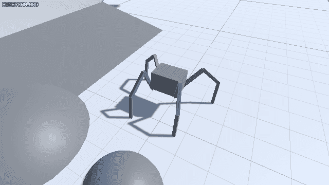
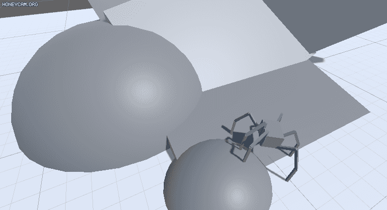
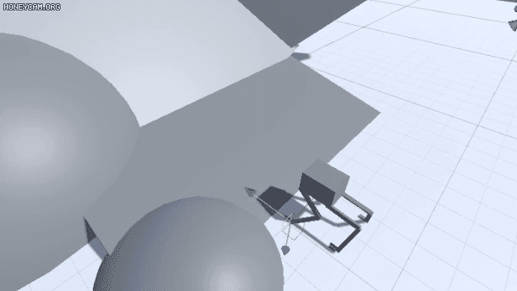
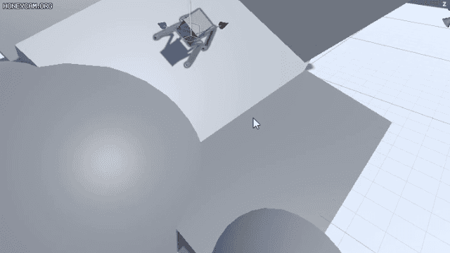
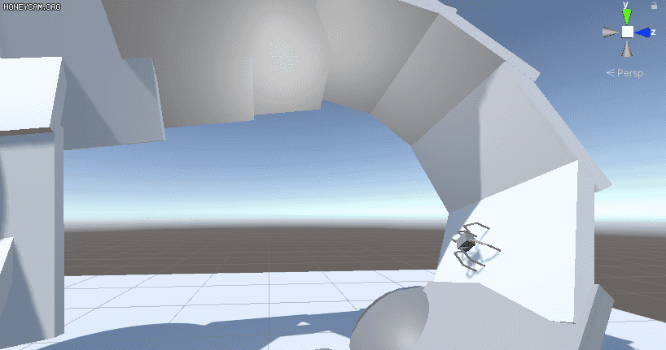

# Procedural Animation in Unity

[Procedural Animation](https://en.wikipedia.org/wiki/Procedural_animation) implemeted in Unity.

[Normal animation](https://en.wikipedia.org/wiki/Skeletal_animation) uses a key frame animation clip, which contains a transforms of joints in chronological order and these pre-recorded animation clips are just 'played' on a bone model.  
Procedural animation, unlike a normal one, uses [IK (Inverse Kinematics)](https://en.wikipedia.org/wiki/Inverse_kinematics) to procedurally position joints, so it automatically generates animation in real-time to allow for a more diverse series of actions and real-time interaction with environmental features.

Demo video: https://youtu.be/pUp133rtDxM  

## Samples
|Style|Image|
|:--:|:--:|
|4 leged  | |
|6 leged  | |
|Dog(?)  | |
|or [Spot](https://en.wikipedia.org/wiki/Boston_Dynamics#Spot)! | |
|[Climbing](https://youtu.be/a3W1PT26aXU)| |
